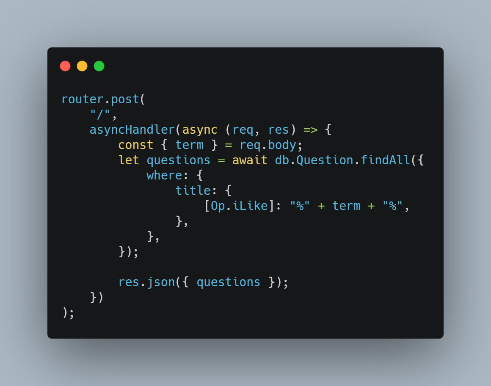
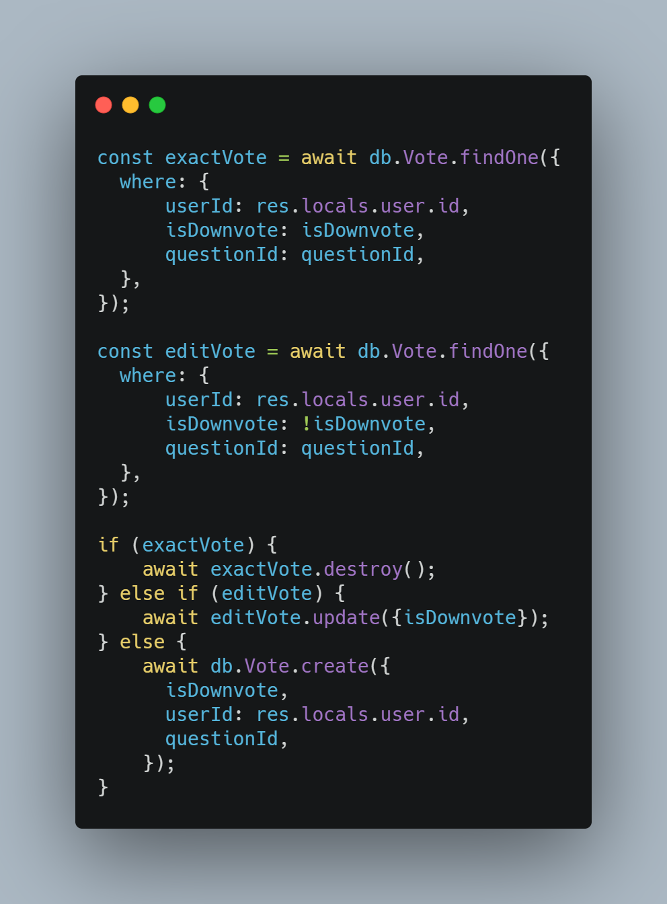
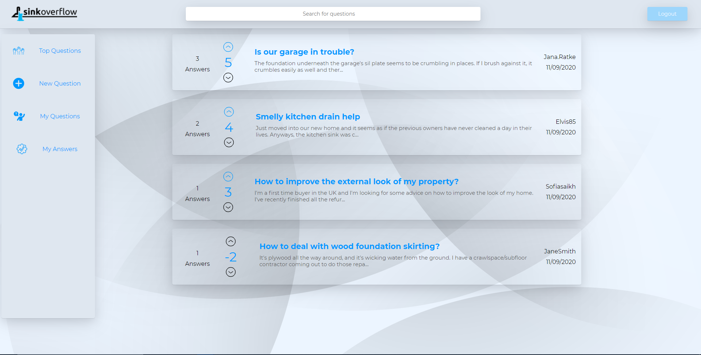
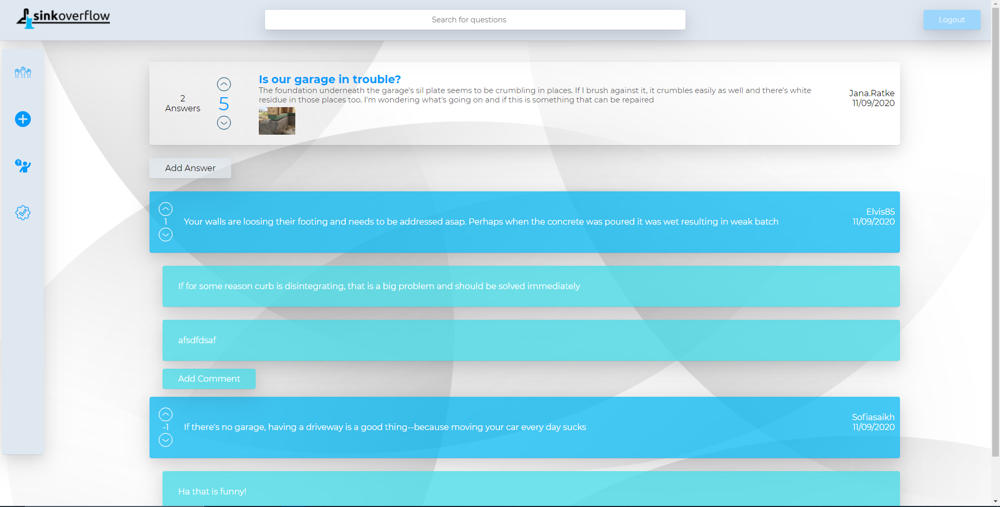
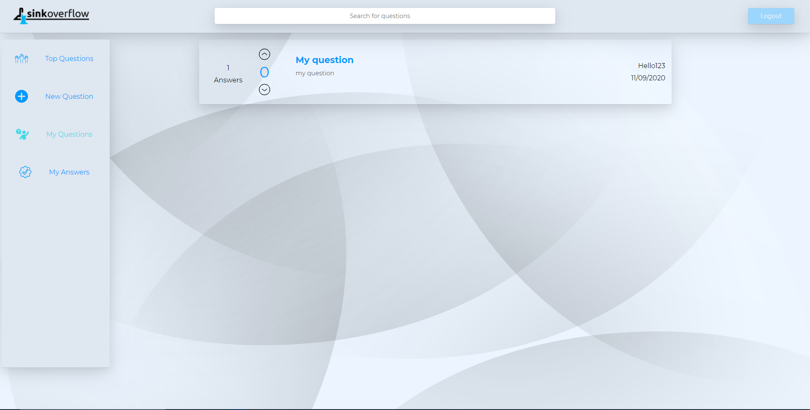
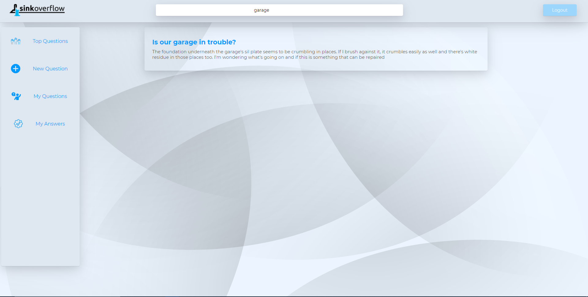
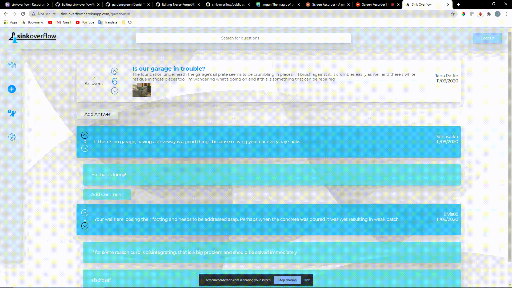

# Sink Overflow

 

**Sink Overflow** is a platform for both home improvement questions and answers, modeled on [Stack Overflow] (https://www.stackoverflow.com/). It allows users to create questions, answers, and comments. It also uses RESTful API routes that allow users to vote on questions and answers, attach images to their questions, and search for questions.

## Demo

Here is a working live demo: [https://sink-overflow.herokuapp.com](https://sink-overflow.herokuapp.com)

## Application Architecture

Dependencies used
- bcrypt
- cookie-parser
- csurf
- dotenv
- faker.js 
- nodemon
- pug
- sequelize
- sequelize-cli
- express
- express-session
- express-validator
- node-postgres

Sink Overflow's backend server was built using Express for Node and utilized the pug templating engine to serve static HTML. The server has a RESTful API layer for some of the more dynamic functionalities, such as voting and search. The server is connected to a PostgreSQL database which leverages sequelize and it's ORM for CRUD operations.

The front end uses vanilla JavaScript and CSS3 loaded from the HTML generated by pug to introduce some UI, UX, and styling.

--------------------------------------------------------
## Backend

#### Database

#### Auth

For authentication we used express session and bcrypt for password hashing. For authorization we attached the session to the response object through custom middleware and protected our routes by accessing the session. 

Below is an example of our basic auth functionality.

#### Search API

The search API is fairly simple and uses SQL wildcards to match search terms and question titles.

Below is an example of how our search API is working for the moment

#### Polymorphic Voting API

The voting api has separate routes for handling question votes and answer votes. The route handles CRUD operations through a single endpoint. This was achieved by checking the user's vote status on a question/answer before each operation. If a user has a vote and then tries to vote again it deletes the vote in the database, if a user changes their vote status from upvote to downvote the item is updated and if a user doesn't already have a vote, it is created. The bigger challenge was getting the DOM to respond to the API route and it's polymorphic nature. 

Below is an example of how our vote API is working for the moment

--------------------------------------------------------
## Pages

### Login (Demo)

### Signup 

### Home (Nav preview)

Our homepage is a feed of top questions which are sorted using quicksort! :D

### Question

This is the page you're taken when you click on an individual question

This is the form to create a new question

This is what the question page looks like if you are the owner of the question and the owner of an answer. (for reference)

There is also a page for viewing question's you've posted.

### Search

The search queries by question title and shows results as the image below.

### Voting

We wanted to showcase voting as it is one of the core functionalities on sink overflow.

## Usage

### Development

Want to contribute?

To fix a bug or add a feature, follow these steps:

- Fork the repository
- Create a new branch with `git checkout -b feature-branch-name`
- Make appropriate changes to the files and push back to github
- Create a Pull Request
   - Use a clear and descriptive title for the issue to identify the suggestion.
   - Include any relevant issue numbers in the PR body, not the title.
   - Provide a comprehensive description of all changes made.

#### Setting Up and Starting a Local Server

1. Download code and `npm install` to install all node dependencies
2. Create a psql db user with createdb privileges.
   - Duplicate the `.env.example` for the `dotenv` package.
   - Update the following variables:
      - `PORT` the port that the server will listen to, 8080 by default
      - `DB_USERNAME` the user of the created psql db user
      - `DB_PASSWORD` the password for the psql db user
      - `SESSION_SECRET` a session secret key for encrypting session id's in the database
      - All other variables should remain the same
3. Setup PostgreSQL database
   - Run `npx dotenv sequelize db:create`
   - Run `npx dotenv sequelize db:migrate`
   - Run `npx dotenv sequelize db:seed:all`
4. Start express server by running `npm start` in the root project directory
5. The server will start on `http://localhost:8080`

--------------------------------------------------------
## Team

| [Jhonathan Ade](https://github.com/adesko24) | [Rashmi Jain](https://github.com/monajain99) | [Daniel Tillero](https://github.com/gardensgreen) |
|-|-|-|

